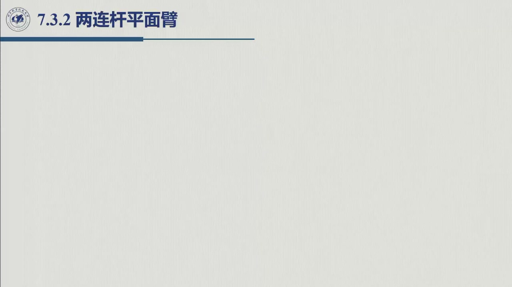
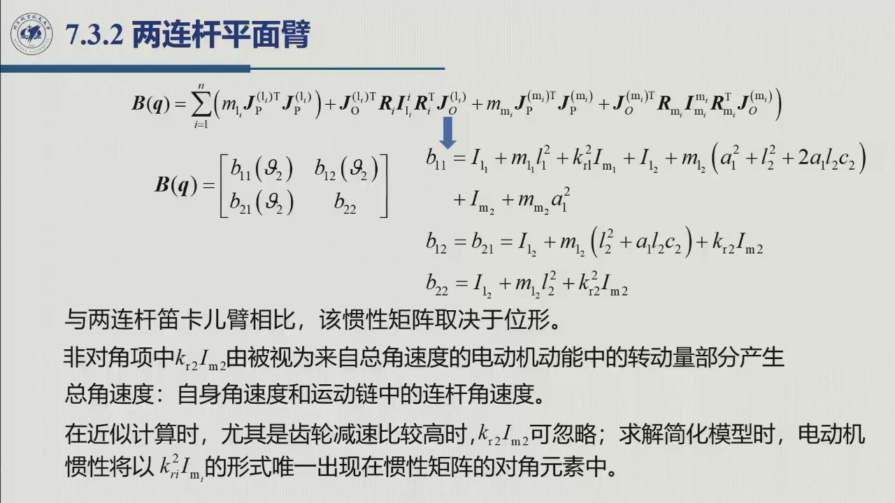
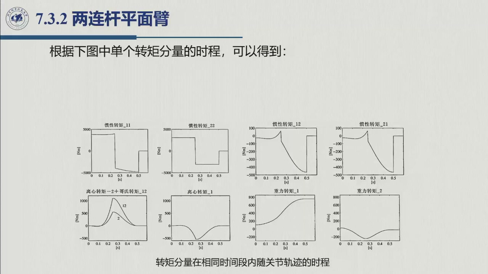

# 6.3.2 两连杆平面臂

上一节的笛卡儿臂只有两个正交移动关节，惯性矩阵是常数对角阵。换成平面内两个转动关节后，第一杆转动会带着第二杆和电机一起绕轴甩动，连杆 2 的夹角 $\vartheta_2$ 还会改变整条臂的转动半径。先想一个具体问题：让第一关节从静止开始加速、第二关节相对转角保持不动（$\ddot\vartheta_2=0$），第二关节是否就不需要出力？先保留自己的判断，算出惯性矩阵的非对角元后再来核对。课堂回看：01:23:45–02:17:20，对应教材 §7.3.2 与例 7.2。

若想先用均匀杆算一次力臂与惯量，可先完成[两连杆第七关](../training/two-link.md#mission-load)，再回到本节计入质心偏置与电机转子的质量、惯量和减速比（两组模型参数不同，不要混用数值）。
## 6.3.2.1 结构与参数

两连杆平面臂（教材图 7.4）：两个转动关节都在垂直平面内，关节 1 固定在基座，关节 2 装在连杆 1 末端。
取

$$\boldsymbol q=[\vartheta_1,\ \vartheta_2]^{\mathrm T}.$$

| 符号 | 含义 |
|:--|:--|
| $a_1,a_2$ | 两连杆长度 |
| $\ell_1,\ell_2$ | 两连杆质心到各自关节轴的距离 |
| $m_1,m_2$ | 两连杆质量 |
| $m_{m_1},m_{m_2}$ | 两转子质量 |
| $I_1,I_2$ | 两连杆相对各自质心的转动惯量 |
| $I_{m_1},I_{m_2}$ | 两转子绕自身轴的转动惯量 |
| $k_{r_1},k_{r_2}$ | 两关节减速比 |

假设转子质心在关节轴上（$\boldsymbol p_{m_i}=\boldsymbol p_{i-1}$，$\boldsymbol z_{m_i}=\boldsymbol z_{i-1}$）。

## 6.3.2.2 雅可比

平面臂的角速度都沿 $z_0$ 轴，故 $R_i$ 对惯性张量无影响，可用标量惯量 $I_i$。平动[雅可比](../recall.md#jacobian-column)：

$$J_P^{(1)}=\begin{bmatrix}-\ell_1s_1&0\\ \ell_1c_1&0\\0&0\end{bmatrix},\qquad
J_P^{(2)}=\begin{bmatrix}-a_1s_1-\ell_2s_{12}&-\ell_2s_{12}\\
a_1c_1+\ell_2c_{12}&\ell_2c_{12}\\0&0\end{bmatrix},$$

转动雅可比：

$$J_O^{(1)}=\begin{bmatrix}0&0\\0&0\\1&0\end{bmatrix},\qquad
J_O^{(2)}=\begin{bmatrix}0&0\\0&0\\1&1\end{bmatrix}.$$

转子的平动雅可比与角速度雅可比：

$$J_P^{(m_1)}=0,\qquad J_P^{(m_2)}=\begin{bmatrix}-a_1s_1&0\\ a_1c_1&0\\0&0\end{bmatrix},$$

$$J_O^{(m_1)}=\begin{bmatrix}0&0\\0&0\\k_{r_1}&0\end{bmatrix},\qquad
J_O^{(m_2)}=\begin{bmatrix}0&0\\0&0\\1&k_{r_2}\end{bmatrix}.$$

注意 $J_O^{(m_2)}$ 的 $(3,1)$ 元是 $1$ 而不是 $0$：转子 2 的绝对角速度是「连杆 1 的角速度 + 自身相对角速度」，
即 $\omega_{m_2}=\dot\vartheta_1+k_{r_2}\dot\vartheta_2$。**这一项会在 $B$ 的非对角元里留下 $k_{r_2}I_{m_2}$。**

（记号 $s_1=\sin\vartheta_1$，$c_1=\cos\vartheta_1$，$s_{12}=\sin(\vartheta_1+\vartheta_2)$，$c_{12}=\cos(\vartheta_1+\vartheta_2)$。）

### 先把第二杆的速度平方展开

连杆 2 质心位置为 $\boldsymbol p_2=(a_1c_1+\ell_2c_{12},\ a_1s_1+\ell_2s_{12})^{\mathrm T}$。把 $J_P^{(2)}$ 乘以 $\dot{\boldsymbol q}=(\dot\vartheta_1,\dot\vartheta_2)^{\mathrm T}$，先得质心线速度两分量：

$$v_{2x}=-a_1s_1\dot\vartheta_1-\ell_2s_{12}(\dot\vartheta_1+\dot\vartheta_2),\qquad
v_{2y}=a_1c_1\dot\vartheta_1+\ell_2c_{12}(\dot\vartheta_1+\dot\vartheta_2).$$

把两个分量的平方相加，用 $s_1^2+c_1^2=1$、$s_{12}^2+c_{12}^2=1$ 以及余弦差角公式 $c_1c_{12}+s_1s_{12}=\cos(\vartheta_1+\vartheta_2-\vartheta_1)=c_2$ 合并：

$$\|\boldsymbol v_2\|^2=a_1^2\dot\vartheta_1^2
+\ell_2^2(\dot\vartheta_1+\dot\vartheta_2)^2
+2a_1\ell_2c_2\,\dot\vartheta_1(\dot\vartheta_1+\dot\vartheta_2).$$

连杆 2 的平动动能 $\frac12m_2\|\boldsymbol v_2\|^2$ 和转动动能 $\frac12I_2(\dot\vartheta_1+\dot\vartheta_2)^2$ 中同时出现 $\dot\vartheta_1^2$、$\dot\vartheta_1\dot\vartheta_2$ 和 $\dot\vartheta_2^2$：例如 $\dot\vartheta_1^2$ 的系数集齐 $m_2(a_1^2+\ell_2^2+2a_1\ell_2c_2)+I_2$，$\dot\vartheta_1\dot\vartheta_2$ 的系数集齐 $I_2+m_2(\ell_2^2+a_1\ell_2c_2)$。余弦耦合项 $2a_1\ell_2c_2$ 由此直接来自连杆 1 末端速度与连杆 2 相对质心速度的夹角。

## 6.3.2.3 惯性矩阵 $B(\boldsymbol q)$

将 $J_P^{(i)},J_O^{(i)},J_P^{(m_i)},J_O^{(m_i)}$ 全部代入 $B=\sum_{i=1}^2\bigl(m_iJ_P^{(i)\mathrm T}J_P^{(i)}+J_O^{(i)\mathrm T}I_iJ_O^{(i)}+m_{m_i}J_P^{(m_i)\mathrm T}J_P^{(m_i)}+J_O^{(m_i)\mathrm T}I_{m_i}J_O^{(m_i)}\bigr)$，把四块逐一展开相加：

$$B(\boldsymbol q)=\begin{bmatrix}b_{11}(\vartheta_2)&b_{12}(\vartheta_2)\\b_{21}(\vartheta_2)&b_{22}\end{bmatrix},$$

$$b_{11}=I_1+m_1\ell_1^2+k_{r_1}^2I_{m_1}+I_2+m_2\bigl(a_1^2+\ell_2^2+2a_1\ell_2c_2\bigr)+I_{m_2}+m_{m_2}a_1^2,$$

$$b_{12}=b_{21}=I_2+m_2\bigl(\ell_2^2+a_1\ell_2c_2\bigr)+k_{r_2}I_{m_2},$$

$$b_{22}=I_2+m_2\ell_2^2+k_{r_2}^2I_{m_2}.$$

::: note 逐项读法 · $b_{11}$ 的七项各是谁 {#note-6.3.2.3.b11}
$b_{11}$ 是「关节 1 单独以角速度 $\dot\vartheta_1$ 运动时，整个系统折算到关节 1 上的等效惯量」。七块可以逐块认领（$k_{r_i}$ 为减速比，$I_{m_i},m_{m_i}$ 为转子 $i$ 的惯量与质量）：

| 项 | 归属 | 为什么在这里 |
|:--|:--|:--|
| $I_1$ | 连杆 1 绕自身质心 | 连杆 1 绕关节 1 转动时的自转惯量 |
| $m_1\ell_1^2$ | 连杆 1 的平动 | 质心离轴 $\ell_1$，平动折算成 $\;m_1\ell_1^2$（平行轴定理） |
| $k_{r_1}^2I_{m_1}$ | 转子 1 折算 | 转子自转角速度是 $k_{r_1}\dot\vartheta_1$，惯量按转速平方折算 |
| $I_2$ | 连杆 2 自转 | 连杆 2 也跟着转 $\dot\vartheta_1$（它挂在关节 1 的下游） |
| $m_2\bigl(a_1^2+\ell_2^2+2a_1\ell_2c_2\bigr)$ | 连杆 2 的平动 | **位形依赖项**在这里：连杆 2 的质心到轴 1 的距离平方是 $a_1^2+\ell_2^2+2a_1\ell_2\cos\vartheta_2$——臂伸直（$c_2=1$）时最大，折叠（$c_2=-1$）时最小。这就是「$B$ 随位形变」的物理来源 |
| $I_{m_2}$ | 转子 2 自转 | 转子 2 的自转惯量直接折到关节 1 上（比例 1） |
| $m_{m_2}a_1^2$ | 转子 2 的平动 | 转子 2 装在连杆 1 末端、离轴 1 有 $a_1$，故按 $m_{m_2}a_1^2$ 折算 |

同理，$b_{12}$ 的四项是「连杆 2 与转子 2 对关节 1 的反作用项」：$I_2$ 与 $m_2(\ell_2^2+a_1\ell_2c_2)$ 来自连杆 2（$c_2$ 使它随位形变），$k_{r_2}I_{m_2}$ 来自转子 2 的总角速度 $\dot\vartheta_1+k_{r_2}\dot\vartheta_2$ 中的交叉项（见下框）；$b_{22}$ 只有连杆 2 与转子 2 的三项——**关节 2 看不见连杆 1**，所以它与 $\vartheta_1$ 无关，是常数。
:::

**与笛卡儿臂的三个差别**：$b_{11}$ 和 $b_{12}$ 通过 $c_2=\cos\vartheta_2$ 依赖第二关节角（惯性矩阵随位形变化）；$b_{12}\neq0$（两关节加速度互相耦合）；而 $b_{22}$ 是常数，因为关节 2 之后只剩连杆 2 与转子 2 自身（锁住关节 1 时它们的转动与 $\vartheta_1$ 无关），但关节 2 完整惯性力矩中仍包含第一关节加速度带来的耦合项 $b_{21}(\vartheta_2)\ddot\vartheta_1$。

现在可以回答节首的问题：即使 $\ddot\vartheta_2=0$、$\dot\vartheta=0$，第一关节加速 $\ddot\vartheta_1$ 时，关节 2 的运动方程仍含耦合项 $b_{21}(\vartheta_2)\ddot\vartheta_1$。要维持相对角度不变，第二关节必须输出这个耦合力矩来抵抗连杆 2 的惯性反作用。

::: note $k_{r_2}I_{m_2}$ 这一项的来源（老师专门解释）
它来自转子 2 的**总角速度** $\omega_{m_2}=\dot\vartheta_1+k_{r_2}\dot\vartheta_2$，而不是仅仅 $k_{r_2}\dot\vartheta_2$。
展开 $\frac12I_{m_2}\omega_{m_2}^2$ 会出现交叉项 $I_{m_2}\dot\vartheta_1(k_{r_2}\dot\vartheta_2)$，这就是 $b_{12}$ 里的
$k_{r_2}I_{m_2}$。**高减速比时**这一项相对 $k_{r_2}^2I_{m_2}$ 可以忽略（$1/k_{r_2}$ 量级），
简化模型里转子惯量只留在对角元上——这是第 5 章「减速比把负载折算到关节侧」的同一逻辑。
:::

## 6.3.2.4 Christoffel 符号与 $C$

先对惯性矩阵的各元素分别求关于 $\vartheta_1,\vartheta_2$ 的偏导。注意 $b_{11},b_{12},b_{22}$ 全都不含 $\vartheta_1$（整体转动 $\vartheta_1$ 不改变两杆之间的夹角），且 $b_{22}$ 连 $\vartheta_2$ 也不含，因此非零偏导只有两项。记

$$h=-m_2a_1\ell_2s_2,$$

逐项求偏导得：

$$\frac{\partial b_{11}}{\partial\vartheta_1}=0,\qquad
\frac{\partial b_{12}}{\partial\vartheta_1}=0,\qquad
\frac{\partial b_{22}}{\partial\vartheta_1}=0,$$

$$\frac{\partial b_{11}}{\partial\vartheta_2}=-2m_2a_1\ell_2s_2=2h,\qquad
\frac{\partial b_{12}}{\partial\vartheta_2}=-m_2a_1\ell_2s_2=h,\qquad
\frac{\partial b_{22}}{\partial\vartheta_2}=0.$$

按第一类 Christoffel 系数定义 $c_{ijk}=\frac12\bigl(\frac{\partial b_{ij}}{\partial q_k}+\frac{\partial b_{ik}}{\partial q_j}-\frac{\partial b_{jk}}{\partial q_i}\bigr)$，逐个代入这六个偏导：

- **$i=1$**：
  $$c_{111}=\frac12\left(\frac{\partial b_{11}}{\partial\vartheta_1}+\frac{\partial b_{11}}{\partial\vartheta_1}-\frac{\partial b_{11}}{\partial\vartheta_1}\right)=0,$$
  $$c_{112}=c_{121}=\frac12\left(\frac{\partial b_{11}}{\partial\vartheta_2}+\frac{\partial b_{12}}{\partial\vartheta_1}-\frac{\partial b_{12}}{\partial\vartheta_1}\right)=\frac12(2h+0-0)=h,$$
  $$c_{122}=\frac12\left(\frac{\partial b_{12}}{\partial\vartheta_2}+\frac{\partial b_{12}}{\partial\vartheta_2}-\frac{\partial b_{22}}{\partial\vartheta_1}\right)=\frac12(h+h-0)=h.$$
- **$i=2$**：
  $$c_{211}=\frac12\left(\frac{\partial b_{21}}{\partial\vartheta_1}+\frac{\partial b_{21}}{\partial\vartheta_1}-\frac{\partial b_{11}}{\partial\vartheta_2}\right)=\frac12(0+0-2h)=-h,$$
  $$c_{212}=c_{221}=\frac12\left(\frac{\partial b_{21}}{\partial\vartheta_2}+\frac{\partial b_{22}}{\partial\vartheta_1}-\frac{\partial b_{12}}{\partial\vartheta_2}\right)=\frac12(h+0-h)=0,$$
  $$c_{222}=\frac12\left(\frac{\partial b_{22}}{\partial\vartheta_2}+\frac{\partial b_{22}}{\partial\vartheta_2}-\frac{\partial b_{22}}{\partial\vartheta_2}\right)=0.$$

再由 $c_{ij}=\sum_{k=1}^2 c_{ijk}\dot\vartheta_k$ 收集矩阵元素：

- $c_{11}=c_{111}\dot\vartheta_1+c_{112}\dot\vartheta_2=h\dot\vartheta_2$，
- $c_{12}=c_{121}\dot\vartheta_1+c_{122}\dot\vartheta_2=h\dot\vartheta_1+h\dot\vartheta_2=h(\dot\vartheta_1+\dot\vartheta_2)$，
- $c_{21}=c_{211}\dot\vartheta_1+c_{212}\dot\vartheta_2=-h\dot\vartheta_1$，
- $c_{22}=c_{221}\dot\vartheta_1+c_{222}\dot\vartheta_2=0$。

合成速度矩阵：

$$C(\boldsymbol q,\dot{\boldsymbol q})=\begin{bmatrix}
h\dot\vartheta_2&h(\dot\vartheta_1+\dot\vartheta_2)\\
-h\dot\vartheta_1&0
\end{bmatrix}.$$

::: note 逐项读法 · 哪些是离心、哪些是科氏 {#note-6.3.2.4.C}
不要只看 $C$ 的单个元素来给力矩分类；它还要乘 $\dot q$。完成乘法后，第一关节的速度项为 $2h\dot\vartheta_1\dot\vartheta_2+h\dot\vartheta_2^2$，第二关节为 $-h\dot\vartheta_1^2$。

两个不同关节速度的乘积通常称科氏项，单个速度的平方称离心项。这里的 $h$ 来自 $m_2a_1\ell_2\cos\vartheta_2$ 的偏导，而非转子的常数交叉惯量 $k_{r_2}I_{m_2}$；常数对构形求导为零。这个 $C$ 一般也不对称，不能把“惯性矩阵对称”的性质套在它上面。
:::

$C\dot{\boldsymbol q}$ 的分量：

$$\bigl(C\dot{\boldsymbol q}\bigr)_1=h\dot\vartheta_2\dot\vartheta_1+h(\dot\vartheta_1+\dot\vartheta_2)\dot\vartheta_2
=h\bigl(2\dot\vartheta_1\dot\vartheta_2+\dot\vartheta_2^2\bigr),$$

$$\bigl(C\dot{\boldsymbol q}\bigr)_2=-h\dot\vartheta_1^2.$$

对照式 (7.82)：关节 1 的速度项是 $-2m_2a_1\ell_2s_2\dot\vartheta_1\dot\vartheta_2-m_2a_1\ell_2s_2\dot\vartheta_2^2$，
关节 2 是 $+m_2a_1\ell_2s_2\dot\vartheta_1^2$，与 $h=-m_2a_1\ell_2s_2$ 的代入一致。

**反对称性验证**：

$$\dot B=\begin{bmatrix}2h\dot\vartheta_2&h\dot\vartheta_2\\h\dot\vartheta_2&0\end{bmatrix},\qquad
N=\dot B-2C=\begin{bmatrix}0&-2h\dot\vartheta_1-h\dot\vartheta_2\\2h\dot\vartheta_1+h\dot\vartheta_2&0\end{bmatrix},$$

确实反对称——这是 [6.2.1](sec6-2-1.md) 的具体例证。

## 6.3.2.5 重力项与完整方程

平面臂取 $y$ 轴竖直向上，$\boldsymbol g_0=[0,-g,0]^{\mathrm T}$。由 $g_i=\partial U/\partial q_i$：

$$g_1=\bigl(m_1\ell_1+m_{m_2}a_1+m_2a_1\bigr)g\cos\vartheta_1+m_2\ell_2g\cos(\vartheta_1+\vartheta_2),$$

$$g_2=m_2\ell_2g\cos(\vartheta_1+\vartheta_2).$$

无摩擦、无末端接触力时，完整方程（教材式 (7.82)）：

$$\begin{aligned}
&\bigl[I_1+m_1\ell_1^2+k_{r_1}^2I_{m_1}+I_2+m_2(a_1^2+\ell_2^2+2a_1\ell_2c_2)+I_{m_2}+m_{m_2}a_1^2\bigr]\ddot\vartheta_1\\
&\quad+\bigl[I_2+m_2(\ell_2^2+a_1\ell_2c_2)+k_{r_2}I_{m_2}\bigr]\ddot\vartheta_2
-2m_2a_1\ell_2s_2\dot\vartheta_1\dot\vartheta_2-m_2a_1\ell_2s_2\dot\vartheta_2^2\\
&\quad+\bigl(m_1\ell_1+m_{m_2}a_1+m_2a_1\bigr)gc_1+m_2\ell_2gc_{12}=\tau_1,
\end{aligned}$$

$$\begin{aligned}
&\bigl[I_2+m_2(\ell_2^2+a_1\ell_2c_2)+k_{r_2}I_{m_2}\bigr]\ddot\vartheta_1
+\bigl[I_2+m_2\ell_2^2+k_{r_2}^2I_{m_2}\bigr]\ddot\vartheta_2\\
&\quad+m_2a_1\ell_2s_2\dot\vartheta_1^2+m_2\ell_2gc_{12}=\tau_2.
\end{aligned}$$

## 6.3.2.6 例 7.2：各项力矩的相对大小

教材例 7.2 给出一组「两连杆完全相同」的数据：

$$a_1=a_2=1\ \mathrm m,\quad \ell_1=\ell_2=0.5\ \mathrm m,\quad m_1=m_2=50\ \mathrm{kg},\quad I_1=I_2=10\ \mathrm{kg\cdot m^2},$$

$$k_{r_1}=k_{r_2}=100,\quad m_{m_1}=m_{m_2}=5\ \mathrm{kg},\quad I_{m_1}=I_{m_2}=0.01\ \mathrm{kg\cdot m^2}.$$

初始位形使末端在 $(0.2,0)$ m（肘下垂，对应 $q_1=1.4706\ \mathrm{rad},\ q_2=-2.9413\ \mathrm{rad}$），两关节各转 $\pi/2$，用时 $0.5$ s，采用梯形速度曲线。仿真结果（教材图 7.5–7.7）给出四条可读结论：

1. **关节 1 的惯性力矩** $b_{11}(\vartheta_2)\ddot\vartheta_1+b_{12}(\vartheta_2)\ddot\vartheta_2$ 随位形和加速度同时变化；
2. **关节 2 的自惯性项** $b_{22}\ddot\vartheta_2$ 在分段常加速度内保持常量，只在加减速度切换时跳变，但总惯性力矩还须加上随 $\vartheta_2$ 变化的耦合项 $b_{21}(\vartheta_2)\ddot\vartheta_1$，不能把两曲线混为一谈；
3. **离心/科氏项**在中间高速段最明显，其符号由 $h=-m_2a_1\ell_2s_2$ 与关节速度乘积决定；
4. **重力项与其他项的大小依赖轨迹速度与参数**：本例速度较快、连杆较重，重力项量级相对较小但不可忽略；若运动放慢，动态项随速度/加速度减小而下降，重力项仍保持不变。

## 6.3.2.7 参数向量与回归矩阵（8 个参数）

对平面臂，按 [6.2.2](sec6-2-2.md) 的扩展连杆法，可取 8 个参数：

$$\boldsymbol\pi=[\pi_1,\dots,\pi_8]^{\mathrm T},\qquad
\begin{aligned}
\pi_1&=m_1+m_{m_2},&
\pi_2&=m_1(\ell_1-a_1),&
\pi_3&=\bar I_1,&
\pi_4&=I_{m_1},\\
\pi_5&=m_2,&
\pi_6&=m_2(\ell_2-a_2),&
\pi_7&=\bar I_2,&
\pi_8&=I_{m_2},
\end{aligned}$$

回归矩阵 $Y$ 为 $2\times8$，其元素只含 $\vartheta,\dot\vartheta,\ddot\vartheta$（教材式 (7.84)）。
这里的8个参数是一种组合表示。能否进一步缩减，取决于回归矩阵中各列的结构依赖，不能直接将名义参数个数当成独立可辨识参数数。

::: intuition 动手实验 · $B$、$C$、$g$ 各自在动（3D）
拖 $\vartheta_1,\vartheta_2$ 与角速度，看表里每一项分别随什么变：$b_{11}$、$b_{12}$ 随**位形**变（里面有 $2a_1\ell_2\cos\vartheta_2$），$b_{22}$ 是**常数**（关节 2 看不见连杆 1），$C$ 随位形与速度变，重力矩 $g_1,g_2$ 随姿态变。按「自由摆动」键则让整条方程 $B\ddot q+C\dot q+g=0$ 以**零输入力矩**自己跑（RK4 积分）：臂会摆下去，你能同时看到位形依赖项、速度耦合项与重力项各自的作用——这正是例 7.2 那张「各力矩分量时程」图的立体版。

:::

## 6.3.2.8 小结与常见错误

两连杆平面臂从质心雅可比集出 $B(\boldsymbol q)$（$b_{11},b_{12}$ 含 $c_2$、$b_{22}$ 为常数），再通过对 $B$ 求偏导算出 Christoffel 符号与 $C$（由 $h=-m_2a_1\ell_2s_2$ 生成），加上 $y$ 轴向上的重力项即得完整方程。验收模型时，需同时核对 $B$ 对称、$\dot B-2C$ 反对称以及静止保持与纯加速两组构形。

::: think 常见错误清单
1. **$b_{12}$ 漏掉 $k_{r_2}I_{m_2}$**：它来自转子 2 的总角速度 $\dot\vartheta_1+k_{r_2}\dot\vartheta_2$ 的交叉项，不是笔误。
2. **$c_{122}$ 写成 $\partial b_{12}/\partial\vartheta_2$ 就完事**：完整公式还要减 $\frac12\partial b_{22}/\partial\vartheta_1$；虽然本例中后者为零，写公式时不能省。
3. **$C\dot{\boldsymbol q}$ 的符号**：$h=-m_2a_1\ell_2s_2$ 自带负号；先定 $h$，再代 $C$，最后与式 (7.82) 逐项对号。
4. **重力方向**：平面臂取 $y$ 竖直向上，$\boldsymbol g_0=[0,-g,0]^{\mathrm T}$；若改取 $z$ 竖直，重力项的表达式须整体换轴。
5. **混淆自惯性项与总惯性力矩**：$b_{22}=I_2+m_2\ell_2^2+k_{r_2}^2I_{m_2}$ 为常数，因此关节 2 的自惯性项 $b_{22}\ddot\vartheta_2$ 在分段常加速度内恒定，但总惯性力矩还包含耦合项 $b_{21}(\vartheta_2)\ddot\vartheta_1$。
:::

::: think 默写点 · 合上书再写
1. 写出两连杆平面臂的 $J_P^{(1)},J_P^{(2)},J_O^{(1)},J_O^{(2)}$ 与转子雅可比 $J_P^{(m_i)},J_O^{(m_i)}$。
2. 写出 $b_{11},b_{12},b_{22}$，并逐项说明 $b_{11}$ 七项及 $b_{12}$ 中 $k_{r_2}I_{m_2}$ 的来源。
3. 写出 $h$、非零 Christoffel 符号、$C$ 矩阵与 $C\dot{\boldsymbol q}$ 的两个分量。
4. 写出 $g_1,g_2$ 与无摩擦完整运动方程（式 (7.82)）。
5. 计算 $\dot B$ 并验证 $N=\dot B-2C$ 反对称。
:::
